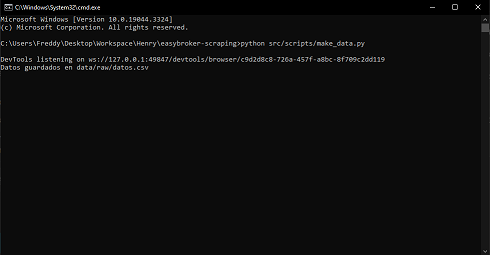

<a name="readme-top"></a>

<!-- PROJECT SHIELDS -->

[![Contributors][contributors-shield]][contributors-url]
[![Forks][forks-shield]][forks-url]
[![Stargazers][stars-shield]][stars-url]
[![Issues][issues-shield]][issues-url]
[![MIT Licencia][Licencia-shield]][Licencia-url]
[![LinkedIn][linkedin-shield]][linkedin-url]

<!-- PROJECT LOGO -->
<br />
<div align="center">
  <a href="https://github.com/FreddyPinto/easybroker-scraping">
    
    
  </a>

<h3 align="center">EasyBroker Scraping</h3>

  <p align="center">
    Web scraping en el sitio web de EasyBroker
    <br />
    <a href="https://github.com/FreddyPinto/easybroker-scraping"><strong>Explorar docs »</strong></a>
    <br />
    <br />
    <a href="https://github.com/FreddyPinto/easybroker-scraping/issues">Reportar Bug</a>
    ·
    <a href="https://github.com/FreddyPinto/easybroker-scraping/issues">Request Feature</a>
  </p>
</div>

<!-- Tabla de contenido -->
<details>
  <summary>Tabla de contenido</summary>
  <ol>
    <li>
      <a href="#acerca-del-proyecto">Acerca del Proyecto</a>
      <ul>
        <li><a href="#desarrollado-con">Desarrollado con:</a></li>
      </ul>
    </li>
    <li>
      <a href="#getting-started">Getting Started</a>
      <ul>
            <li><a href="#instalación">Instalación</a></li>
      </ul>
    </li>
    <li><a href="#uso">Uso</a></li>
    <li><a href="#roadmap">Roadmap</a></li>
    <li><a href="#contribuciones">Contribuciones</a></li>
    <li><a href="#licencia">Licencia</a></li>
    <li><a href="#contacto">Contacto</a></li>
  </ol>
</details>

<!-- Acerca del Proyecto -->

## Acerca del Proyecto

<p align="center">
  
</p>

Este proyecto utiliza Selenium y BeautifulSoup para hacer web scraping en el sitio web de EasyBroker y extraer el nombre, ubicación, teléfono y pagina web de las inmobiliarias registradas.

<p align="right">(<a href="#readme-top">volver arriba</a>)</p>

### Desarrollado con:

- [![Python][Python]][Python-url]
- [![Pandas][Pandas]][Pandas-url]
- [![Selenium][Selenium]][Selenium-url]
- [![Jupiter][Jupiter]][Jupiter-url]
- [![VSC][VSC]][VSC-url]
- [![BeautifulSoup][BeautifulSoup]][BeautifulSoup-url]

<p align="right">(<a href="#readme-top">volver arriba</a>)</p>

<!-- GETTING STARTED -->

## Getting Started

Para ejecutar este proyecto localmente sigue estos pasos para configurarlo:

### Instalación

1. Clona el repositorio:
   ```sh
   git clone https://github.com/FreddyPinto/easybroker-scraping.git
   ```
2. Crea un entorno virtual de Python:
   ```sh
   python -m venv venv
   ```
3. Activa el entorno virtual:
   - En Windows:
     ```sh
     .\env\Scripts\activate
     ```
   - Unix o MacOS:
     ```sh
     env/bin/activate
     ```
4. Instala las dependencias:
   ```sh
   pip install -r requirements.txt
   ```
5. Configura tus variables de entorno. Crea un archivo `.env` en la raíz del proyecto y añade tus credenciales de EasyBroker:
    ```sh
    EMAIL=tu_email
    PASSWORD=tu_contraseña
    ```
<p align="right">(<a href="#readme-top">volver arriba</a>)</p>

<!-- USAGE EXAMPLES -->

## Uso

Ejecuta el script de Python para hacer web scraping en el sitio web de EasyBroker:

```
python src/scripts/make_data.py
```

Esto generará un archivo CSV en la carpeta data con la información extraída.

<p align="right">(<a href="#readme-top">volver arriba</a>)</p>

<!-- ROADMAP -->

## Roadmap

Este proyecto se realizó como un Producto Mínimo Viable, por lo que se podrían mejorar algunos aspectos en el futuro, con la finalidad de lograr un producto más completo y robusto. Algunas de las posibles mejoras son:

- [ ] Mejorar la eficiencia del web scraping, explorando técnicas para acelerar la extracción de datos.

- [ ] Implementar un manejo de errores más robusto para manejar posibles fallos durante el web scraping.

- [ ] Explorar el uso de una base de datos para almacenar los datos extraídos, lo que permitiría consultas más eficientes y un almacenamiento más seguro.

- [ ] Mejorar la limpieza y el preprocesamiento de los datos, para asegurar que los datos estén en el formato más útil para el análisis.

- [ ] Implementar pruebas automatizadas para asegurar que el código funciona como se espera después de cada cambio.

- [ ] Explorar otras bibliotecas o herramientas para el web scraping que podrían ofrecer mejores prestaciones o facilidades de uso.

- [ ] Mejorar la documentación del proyecto, incluyendo más detalles sobre cómo se realiza el web scraping y cómo se pueden utilizar los datos extraídos.

Consulta los [issues abiertos](https://github.com/FreddyPinto/easybroker-scraping/issues) para proponer características (y problemas conocidos).

<p align="right">(<a href="#readme-top">volver arriba</a>)</p>

<!-- CONTRIBUTING -->

## Contribuciones

Las contribuciones son lo que hacen que la comunidad de código abierto sea un lugar increíble para apBeautifulSoup, inspirarse y crear. Cualquier contribución que hagas será **muy apreciada**.

Si tienes una sugerencia para mejorar este proyecto, haz un fork del repositorio y crea un pull request. También puedes simplemente abrir un issue con la etiqueta _“enhancement”_. ¡No olvides darle una estrella al proyecto! Gracias de nuevo.

1. Haz un fork del Proyecto
2. Crea tu feature Branch (`git checkout -b feature/AmazingFeature`)
3. Haz commit de tus cambios (`git commit -m 'Add some AmazingFeature'`)
4. Push a la Branch (`git push origin feature/AmazingFeature`)
5. Abre un Pull Request

<p align="right">(<a href="#readme-top">volver arriba</a>)</p>

<!-- Licencia -->

## Licencia

Distribuido bajo la licencia MIT. Consulta el archivo [LICENSE](LICENSE) para más información.

<p align="right">(<a href="#readme-top">volver arriba</a>)</p>

<!-- Contacto -->

## Contacto

Freddy Pinto - freddypinto@outlook.com

[![LinkedIn][linkedin-shield]][linkedin-url]

Project Link: [https://github.com/FreddyPinto/easybroker-scraping](https://github.com/FreddyPinto/easybroker-scraping)

<p align="right">(<a href="#readme-top">volver arriba</a>)</p>

<!-- MARKDOWN LINKS & IMAGES -->
<!-- https://www.markdownguide.org/basic-syntax/#reference-style-links -->

[contributors-shield]: https://img.shields.io/github/contributors/FreddyPinto/easybroker-scraping.svg?style=for-the-badge
[contributors-url]: https://github.com/FreddyPinto/easybroker-scraping/graphs/contributors
[forks-shield]: https://img.shields.io/github/forks/FreddyPinto/easybroker-scraping.svg?style=for-the-badge
[forks-url]: https://github.com/FreddyPinto/easybroker-scraping/network/members
[stars-shield]: https://img.shields.io/github/stars/FreddyPinto/easybroker-scraping.svg?style=for-the-badge
[stars-url]: https://github.com/FreddyPinto/easybroker-scraping/stargazers
[issues-shield]: https://img.shields.io/github/issues/FreddyPinto/easybroker-scraping.svg?style=for-the-badge
[issues-url]: https://github.com/FreddyPinto/easybroker-scraping/issues
[Licencia-shield]: https://img.shields.io/github/license/FreddyPinto/easybroker-scraping.svg?style=for-the-badge
[Licencia-url]: https://github.com/FreddyPinto/easybroker-scraping/blob/main/LICENSE
[linkedin-shield]: https://img.shields.io/badge/-LinkedIn-black.svg?style=for-the-badge&logo=linkedin&colorB=555
[linkedin-url]: https://www.linkedin.com/in/FreddyPinto-/
[product-screenshot]: images/screenshot.jpg
[Python]: https://img.shields.io/badge/Python-333333?style=flat&logo=python&labelColor=white
[Python-url]: https://www.python.org/
[Selenium]: https://img.shields.io/badge/-Selenium-333333?style=flat&logo=selenium&labelColor=white
[Selenium-url]: https://www.selenium.dev/
[BeautifulSoup]: https://img.shields.io/badge/-BeautifulSoup-333333?style=flat&logo=beautifulSoup
[BeautifulSoup-url]: https://www.crummy.com/software/BeautifulSoup/
[Pandas]:https://img.shields.io/badge/-Pandas-333333?style=flat&logo=pandas&logoColor=black&labelColor=white
[Pandas-url]:https://pandas.pydata.org/
[Jupiter]: https://img.shields.io/badge/-Jupyter_Notebook-333333?style=flat&logo=jupyter&labelColor=white
[Jupiter-url]: https://jupyter.org/
[VSC]:https://img.shields.io/badge/-Visual_Studio_Code-333333?style=flat&logo=visualstudiocode&logoColor=blue&labelColor=white
[VSC-url]:https://code.visualstudio.com/
